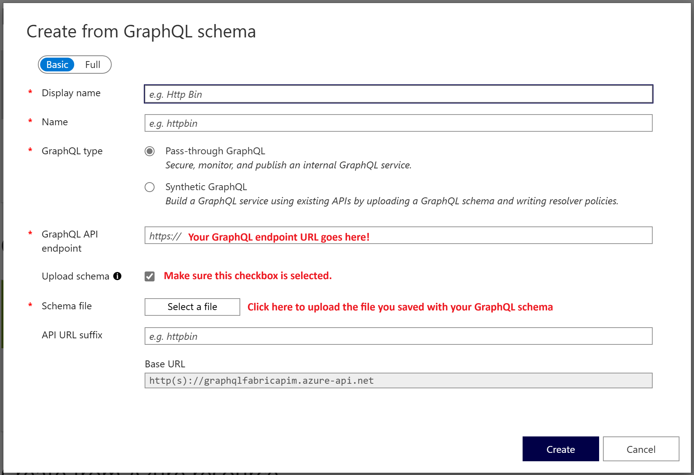
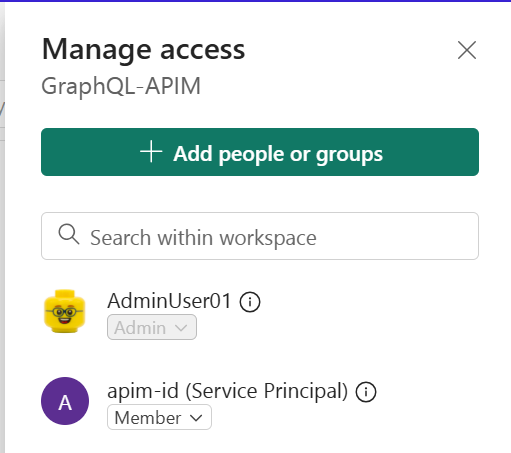

# Integrate Azure API Management (APIM) with Fabric API for GraphQL


Integrating Azure API Management (APIM) with Microsoft Fabric’s API for GraphQL can significantly enhance your API’s capabilities by providing robust scalability and security features such as identity management, rate limiting, and caching. We will guide you through the process of setting up and configuring these features.


## Add a Fabric GraphQL API to Azure API Management

For this section, we assume that you have a GraphQL API in Fabric and APIM instance already up and running. If not, you can follow the [instructions](/azure/api-management/get-started-create-service-instance) on [how to create a GraphQL API in Fabric](get-started-api-graphql.md) or you can click on **Start with sample SQL database** in the API for GraphQL portal to start from a new API.

To get started retrieve your API endpoint from the Fabric portal by going in your GraphQL item and clicking on the **Copy endpoint** button in the ribbon. You will also need to save your GraphQL schema to a file, which you can accomplish by clicking on the **Export schema** button and saving it to a file in your local device:


Now navigate to your API Management instance in the Azure portal and select **APIs** > **+ Add API**.

Choose the GraphQL icon and, in the APIM **Create from GraphQL schema** screen, fill in the required fields such as Display name, Name, and GraphQL API endpoint. Select **Upload schema** and use the schema file you downloaded previously:

[](media/api-graphql-apim/api-graphql-apim-create.png)

## Using managed identities with APIM and API for GraphQL in Fabric

Next, we need to configure a policy for authentication using a managed identity to handle authentication for this API. You can [create a managed identity in the Azure portal](/entra/identity/managed-identities-azure-resources/how-manage-user-assigned-managed-identities.md) or by using any of the tools available to do so.

Now we have a managed identity credential we can use for authentication, we need grant it permissions to the GraphQL item in Fabric. For the sake of simplicity, we add the managed identity (in this example, **apim-id**) as a member of the workspace where both the GraphQL API and its data source are located:



If you prefer to enable access directly to the Fabric items such as the API itself and the data sources attached to the API such as a LakeHouse or SQL database, you need to grant the appropriate permissions for the managed identity on each item, especially in case they were attached to the API using Single Sign-On (SSO) authentication. You can find more information in the [permissions summary](get-started-api-graphql.md#permissions-summary).

Once you have granted your credential permissions to your workspace, Fabric GraphQL API and/or data sources attached to it, you will need to indicate to APIM that you want to leverage that credential to perform authentication. Back to the APIM console, go to **Security** > **Managed identities** and add the same user assigned managed identity you’re using to access the Fabric GraphQL API.

Next go to the “API Policies” tab in the GraphQL API you created earlier, then edit the inbound processing policy by adding the following entries below `<inbound><base/>`:
```xml
<authentication-managed-identity 
            resource="https://analysis.windows.net/powerbi/api" 
            client-id="MANAGED IDENTITY CLIENT ID GOES HERE" 
            output-token-variable-name="token-variable" 
            ignore-error="false" />
<set-header name="Authorization" exists-action="override">
            <value>@("Bearer " + (string)context.Variables["token-variable"])</value>
</set-header>
```

Make sure to replace the client ID in the snippet above with your managed identity’s client ID. Save the policy to continue.

Now, back to the API, head to the **Test** tab and confirm you can issue queries and/or mutations to your Fabric data via GraphQL:

[](media/api-graphql-apim/api-graphql-apim-test.png)

Testing the successful connection between APIM and Fabric GraphQL

## Caching

APIs and operations in API Management can be configured with response caching. Response caching can significantly reduce latency for API callers and backend load for API providers. APIM has support for built-in caching, or you can choose to use your own Redis instance. In either case, you need to define your caching policy. Here we have the previous policy amended with a simple caching configuration that would work for most scenarios:

```xml
<policies>
    <inbound>
        <base />
        <authentication-managed-identity 
            resource="https://analysis.windows.net/powerbi/api" 
            client-id="MANAGED IDENTITY CLIENT ID GOES HERE" 
            output-token-variable-name="token-variable" 
            ignore-error="false" />
        <set-header name="Authorization" exists-action="override">
            <value>@("Bearer " + (string)context.Variables["token-variable"])</value>
        </set-header>
        <cache-lookup-value 
            key="@(context.Request.Body.As<String>(preserveContent: true))" 
            variable-name="cachedResponse" 
            default-value="not_exists" />
    </inbound>
    <!-- Control if and how the requests are forwarded to services  -->
    <backend>
        <choose>
            <when condition="@(context.Variables.GetValueOrDefault<string>("cachedResponse") == "not_exists")">
                <forward-request />
            </when>
        </choose>
    </backend>
    <!-- Customize the responses -->
    <outbound>
        <base />
        <choose>
            <when condition="@(context.Variables.GetValueOrDefault<string>("cachedResponse") != "not_exists")">
                <set-body>@(context.Variables.GetValueOrDefault<string>("cachedResponse"))</set-body>
            </when>
            <when condition="@((context.Response.StatusCode == 200) && (context.Variables.GetValueOrDefault<string>("cachedResponse") == "not_exists"))">
                <cache-store-value key="@(context.Request.Body.As<String>(preserveContent: true))" value="@(context.Response.Body.As<string>(preserveContent: true))" duration="60" />
            </when>
        </choose>
    </outbound>
    <!-- Handle exceptions and customize error responses  -->
    <on-error>
        <base />
    </on-error>
</policies>
```

You can confirm the requests are getting cached by [tracing a GraphQL API query or mutation](/azure/api-management/api-management-howto-api-inspector#trace-a-call-in-the-portal) in the APIM portal. For advanced caching scenarios, please refer to the [APIM documentation](/azure/api-management/api-management-howto-cache) on caching.

## Rate limiting

You can limit the number of API calls a client can make in a specific time period. Here’s a sample rate limiting policy entry you can add below `<inbound><base/>` that enforces no more than 2 calls every 60 seconds for a given user:

```xml
<rate-limit-by-key 
    calls="2" 
    renewal-period="60" 
    counter-key="@(context.Request.Headers.GetValueOrDefault("Authorization"))" 
    increment-condition="@(context.Response.StatusCode == 200)" 
    remaining-calls-variable-name="remainingCallsPerUser" />
```

After sending more than 2 API calls in a minute, you’ll receive an error message:

```json
{
    "statusCode": 429,
    "message": "Rate limit is exceeded. Try again in 58 seconds."
}
```

For more details on how to configure rate limiting policies in APIM, please refer to the [documentation](/microsoft-cloud/dev/dev-proxy/concepts/implement-rate-limiting-azure-api-management).


Integrating Microsoft Fabric API for GraphQL with Azure API Management brings together the best of both worlds: the rich data capabilities of Fabric and the enterprise-grade gateway features of APIM. By configuring managed identities, you enable secure authentication to Fabric. With custom caching and rate limiting policies, you gain fine-grained control over performance, cost, and user experience—tailored for the unique characteristics of GraphQL APIs.

This setup not only provides more options to secure your Fabric data but also provides the scalability and observability required to support production workloads across teams and tenants.

## Related content

- [Fabric API for GraphQL Editor](api-graphql-editor.md)
- [Azure API Management documentation](/azure/api-management/api-management-key-concepts)