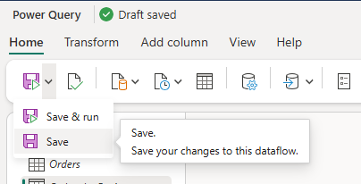
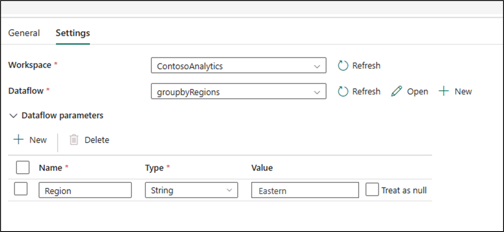

# Use public parameters in Dataflow Gen2 (Preview)

>[!NOTE]
>Public parameters in Fabric Dataflow Gen2 are available as a preview feature. Only Dataflow Gen2 with CI/CD support can apply this experience.

Parameters in Dataflow Gen2 allow you to dynamically control and customize dataflows, making them more flexible and reusable by enabling different inputs and scenarios without modifying the dataflow itself. It helps keep things organized by reducing the need for multiple dataflows and centralizing control within a single, parameterized dataflow.

**Public parameters** in Dataflow Gen2 is a new mode where you can allow your Dataflow to be refreshed by passing parameter values outside of the Power Query editor through the Fabric REST API or through native Fabric experiences. It allows you to have a more dynamic experience with your Dataflow where each refresh can be invoked with different parameters that affect how your Dataflow is refreshed.

## Prerequisites

* **A Dataflow Gen2 with CI/CD support**
* **Parameters must be set within your Dataflow.** [Learn more on how to set Query parameters in Dataflow](/power-query/power-query-query-parameters).

## Considerations and limitations

* **Dataflows with the public parameters mode enabled cannot be scheduled for refresh through the Fabric scheduler.** The only exception is a dataflow with no required parameters set.
* **Dataflows with the public parameters mode enabled cannot be manually triggered through the Fabric Workspace list or lineage view.** The only exception is a dataflow with no required parameters set.
* **Parameters that affect the resource path of a data source or a destination are not supported.** Connections are linked to the exact data source path defined in the authored dataflow and can't be currently override to use other connections or resource paths.
* **Dataflows with incremental refresh can't leverage this new mode.**
* **Only parameters of the type *decimal number*, *whole number*, *text* and *true/false* can be passed for override.**  Any other data types don't produce a refresh request in the refresh history but show in the monitoring hub. 
* **The public parameters mode allows users to modify the logic defined within the Dataflow by overriding the parameter values.** It  would allow others who have permissions to the dataflow to refresh the data with other values, resulting in different outputs from the data sources used in the dataflow.
* **Monitoring hub does not display information about the parameters passed during the invocation of the dataflow.**
* **Staged queries will only keep the last data refresh of a Dataflow stored in the Staging Lakehouse.** Users are able to look at the data from the Staging Lakehouse using the Dataflows connector to determine what was data is stored. Defining data destinations when using the public parameters mode is highly encouraged.
* **When submitting a duplicated request for the same parameter values, only the first request will be accepted and subsequent will be rejected until the first request finishes its evaluation.**
* **In the context of Data destinations, parameters cannot be used to change the mapping schema.** The Dataflow refresh will apply all mappings and data destination settings that were saved by the Dataflow during the authoring stage. Check out the article for more information on [data destinations and managed settings in Dataflow Gen2](dataflow-gen2-data-destinations-and-managed-settings.md).

## Enable the public parameter mode

As the author of the dataflow, open the Dataflow. Inside the Home tab of the ribbon, select the **Options** button.

Selecting the button opens a new **Options** dialog. In the vertical menu, select the option with the label *Parameters* inside of the *dataflow* group. Within the Parameters section you can enable the option that reads ***"Enable parameters to be discovered and override for execution"*** to enable the public parameters mode.

Select the **OK** button to commit these changes.

When this mode is enabled, you get a notification in the **Manage parameters** dialog that reads "Public parameter mode is enabled" at the top of the dialog.

Once the public parameter mode has been enabled, you can save your dataflow.

## Pass custom parameter values for refresh

The public parameter mode follows the definition of the parameters inside the dataflow where there's a distinction between required and nonrequired parameters.

* **Required parameters**: if a parameter is set as required, in order to refresh the dataflow a value needs to be passed to the refresh job. The refresh fails if no value is passed for a parameter that is set to required.
* **Non-required parameters**: these are also called ***optional*** parameters and no value is required to be passed for a refresh to be triggered. If no value is passed, the **Current value** defined within your parameter used for refresh. However, you can always pass an override value, which is used for refresh.

## Use the Dataflow refresh activity within Data Pipelines

>[!NOTE]
>We recommend reading more about the [dataflow activity from Fabric data pipelines](dataflow-activity.md) to understand all its capabilities. 

When you create a pipeline in Fabric, you can use the dataflow refresh activity to trigger the refresh of a Dataflow Gen2 with CI/CD support that has the public parameters mode enabled. 

You can select the dataflow that you want to use and set the parameters that you want to use in the **Dataflow parameters** section.

In the **Dataflow parameters** section, you can pass the name of the parameter, the type of value that you want to pass, and the value to pass. You can manually add all the supported parameters that you want to override.

>[!IMPORTANT]
>Be sure to pass the name of the parameters exactly as typed inside of the dataflow as parameter names are case sensitive.
 
