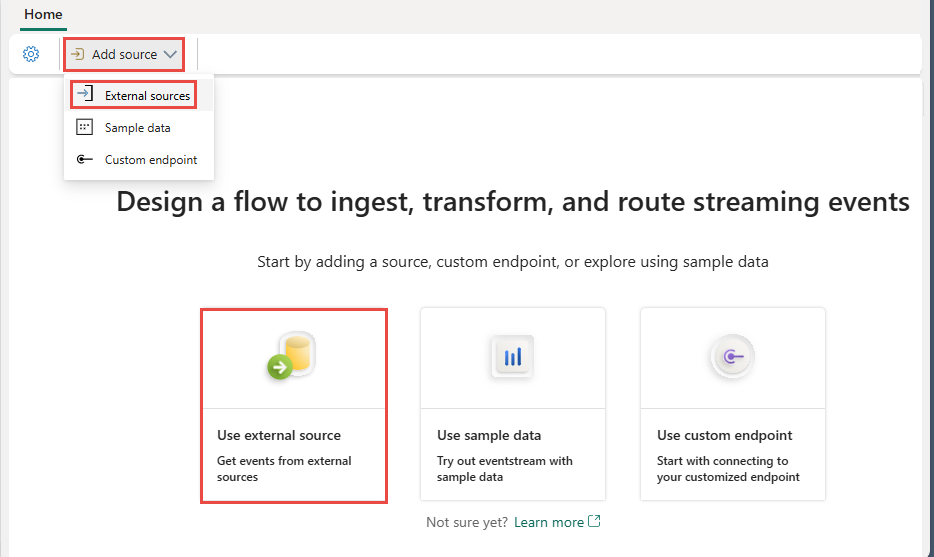
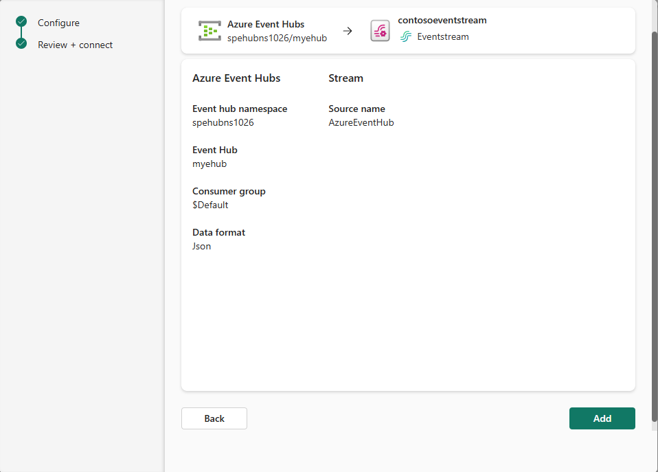
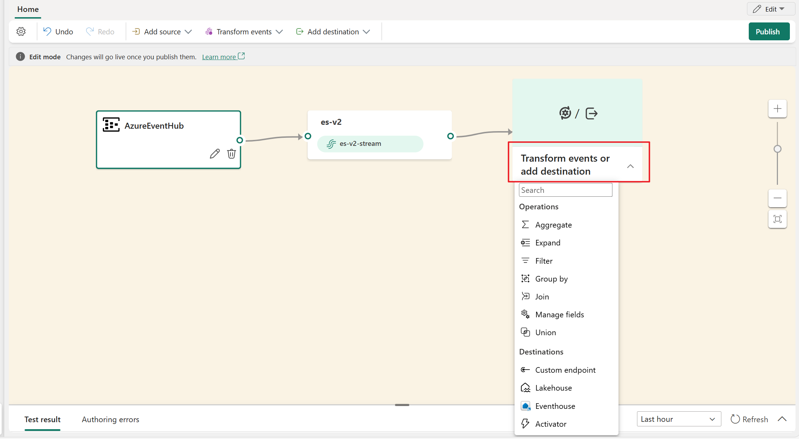
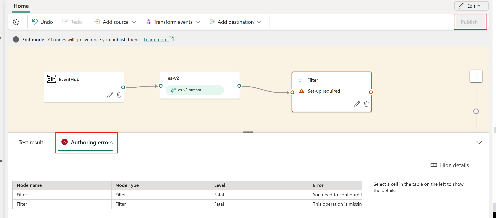
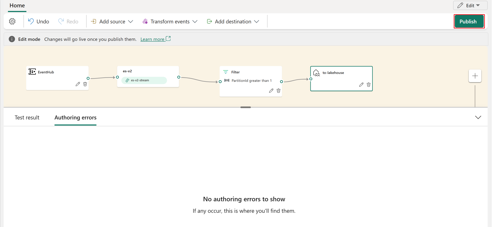
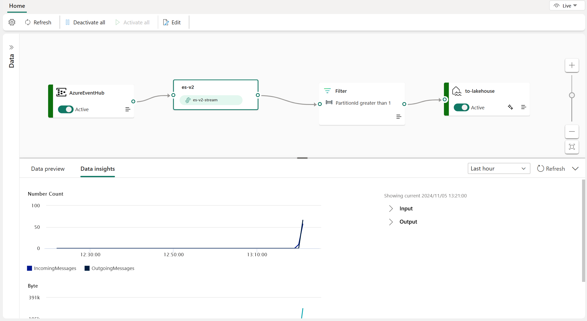

# Edit and publish a Microsoft Fabric eventstream

This article shows you how to edit and publish a Microsoft Fabric eventstream.

## Edit mode and Live view

Fabric event streams offer two distinct modes, **Edit mode** and **Live view**, to provide flexibility and control over your data streams. If you create a new eventstream with enhanced capabilities enabled, you can modify your eventstreams in **Edit mode** and design stream processing operations for your data streams by using a no-code editor. Once you're done, you can publish your eventstreams and visualize how your eventstreams start streaming and processing data in **Live view**.

Here's an overview of everything you find in the two different modes:

**Edit mode:**

- Any changes made within Edit mode aren't implemented until you choose to publish them, ensuring you have full control over the development process of your eventstreams.

- There's no risk of test data being streamed to your eventstreams or destinations. This mode is designed to provide a secure environment for testing without affecting your actual data streams.

- If you make changes to an existing eventstream, those changes aren't implemented until you publish the eventstream.

**Live view:**

- You can visualize how your eventstreams receive, transform, and route your events from sources to various destinations after you publish the changes.

- You can pause the flow of data on any selected sources and destinations, providing you with more control over your data streams.

## Create a new eventstream

[!INCLUDE [create-an-eventstream](./includes/create-an-eventstream.md)]

1. On the next screen, select **Add external source** to stream your data to Fabric event streams.

   
1. Select **Connect** on the **Azure Event Hubs** tile.

   :::image type="content" source="media/edit-publish/select-azure-event-hubs.png" alt-text="Screenshot that shows the Select a data source page with Azure Event Hubs selected."::: 
1. On the **Connect data source** page, select **New connection**.

   :::image type="content" source="media/edit-publish/new-connection-link.png" alt-text="Screenshot that shows the Connect data source page with the New connection link selected." lightbox="media/edit-publish/new-connection-link.png":::     
1. In the popup window, in the **Connection settings** section, specify the name of the Event Hubs namespace and the event hub in it. 

   :::image type="content" source="media/edit-publish/connection-settings.png" alt-text="Screenshot that shows the connection settings for an event hub." lightbox="media/edit-publish/connection-settings.png":::     
1. In the **Connection credentials** section, specify the access key name and its value, and then select **Connect**.

    :::image type="content" source="media/edit-publish/connection-credentials.png" alt-text="Screenshot that shows the connection credentials for an event hub." lightbox="media/edit-publish/connection-credentials.png":::     
1. Now, on the **Connect** page, specify the **consumer group**, and select the **data format** you want to use, and then select **Next**.

    :::image type="content" source="media/edit-publish/configure-azure-event-hubs-resource.png" alt-text="Screenshot that shows the Connect page with the additional configuration for the event hub." lightbox="media/edit-publish/configure-azure-event-hubs-resource.png":::         
1. On the **Review + connect** page, review settings, and select **Add**. 

   
1. You're now in the eventstream **Edit mode**. Select **Refresh** to preview your Azure Event Hubs data.

   

## Publish your eventstream

To publish your eventstream, ensure that your eventstream has both a configured source and destination, and that no authoring errors display.

The following steps show how you can add event processing operations and a destination to your eventstream and then publish it.

1. You can expand the dropdown menu on the editor and choose a **Destination** or **Operation** to add to your eventstream.

   

1. The **Publish** button is disabled if there are any authoring errors. For example, you must add a destination for a **Filter** operation before you can publish it.

   

1. After you configure a Lakehouse destination, select **Publish** to commit your changes.

   

   This action switches your eventstream from **Edit** mode to **Live** view, initiating real-time data processing.

   

## Related content

- [New capabilities in Microsoft Fabric event streams](overview.md)
- [Create default and derived eventstreams](create-default-derived-streams.md)
- [Route data streams based on content](route-events-based-on-content.md)
