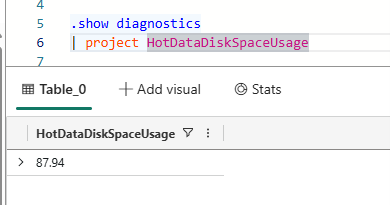
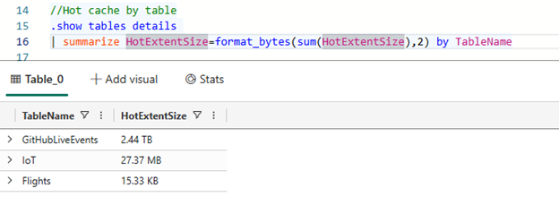
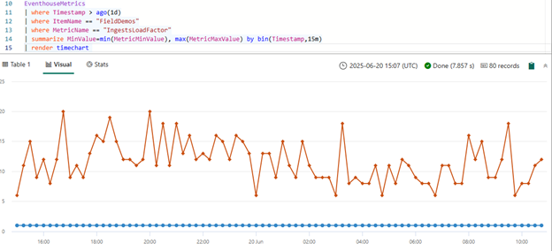
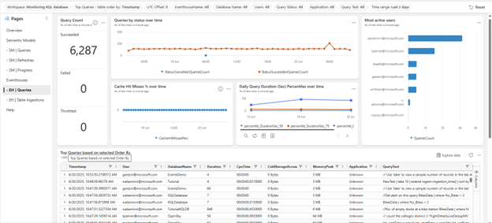

# Understanding Eventhouse Compute Usage

Microsoft Fabric Eventhouse is built to adjust the compute according to your usage patterns. This means that the Eventhouse capacity usage will automatically scale to meet your workload requirements.

This article will walk you through some of the most common factors that determine the size of your Eventhouse compute so that you can make the right decisions to optimize your Eventhouse.

## Key Factors Influencing Compute Size

Several factors determine the right size for your Eventhouse compute.  By understanding these factors, you can make informed decisions to optimize your usage.

### Cache Utilization

The amount of data kept in hot cache is a main factor affecting the size of your Eventhouse compute. Each compute size provides a certain amount of hot cache capacity. As you approach this limit, both compute and cache space may increase accordingly. Therefore, it is critical to manage your hot cache [utilization effectively](https://learn.microsoft.com/en-us/kusto/management/cache-policy?view=microsoft-fabric).

#### Understanding the Current Cache Capacity Level

To understand your current hot cache usage, you can run the following command:

```
.show diagnostics
| project HotDataDiskSpaceUsage
```



This command displays the percentage of hot cache space currently used.

·       If hot cache usage reaches ~95% then your compute will scale up to the next level irrelevant of other usage (CPU, Ingestion, etc..).

·       If hot cache usage goes below ~35% and all other scale-in factors are met (CPU, Ingestion, etc..) then your compute will scale-in to the next smaller size. 

To understand where the hot cache is being consumed you need to drill down to specific tables. Start by running the below command.

```
.show tables details
| summarize HotExtentSize=format\_bytes(sum(HotOriginalSize),2)
```



To adjust the caching policy at the table level modify the [Table Level Caching Policy](https://learn.microsoft.com/en-us/kusto/management/cache-policy?view=microsoft-fabric&preserve-view=true).

## Ingestion Capacity

Another factor in the size of your Eventhouse is the ingestion utilization. To ensure timely ingestion, we monitor your ingestion load and adjust the Eventhouse compute capacity to accommodate the data being ingested.

### Checking Ingestion Load

When looking at the ingestion load you want to observe this over time. The best way to accomplish this is by enabling [Workspace Monitroing](https://learn.microsoft.com/en-us/fabric/fundamentals/enable-workspace-monitoring).

Once this is enabled you can run the following query to see your current ingestion load:

```
EventhouseMetrics
| where Timestamp > ago(1d)
| where ItemName == "FieldDemos"
| where MetricName == "IngestsLoadFactor"
| summarize MinValue=min(MetricMinValue), max(MetricMaxValue) by bin(Timestamp,15m)
| render timechart
```
  


This will show the percentage of the ingestion capacity being used by the current Eventhouse compute size. A few takeaways from this number:

- If you are taking up consistently 70% or more of the ingestion capacity at the current size the compute is sized based on ingestion. This means that unless the ingestion pattern changed you will continue to run at this compute size or larger, irrelavent of other activity.

- If this percentage consistently drops below 70% that means the compute is sized based on other factors. This could be the minimum capacity settings, cache utilization, or query load on the Eventhouse. 

This is also available in the [Workspace Monitoring Dashboard](https://blog.fabric.microsoft.com/en-us/blog/introducing-template-dashboards-for-workspace-monitoring?ft=All) in the “EH | Table Ingestions” tab.


## Query Load

Query load and performance factors in the size of compute Eventhouse needs. The best way to monitor this performance is to enable [Workspace Monitroing](https://learn.microsoft.com/en-us/fabric/fundamentals/enable-workspace-monitoring) and utilize the [Workspace Monitoring Dashboard](https://blog.fabric.microsoft.com/en-us/blog/introducing-template-dashboards-for-workspace-monitoring?ft=All).

You can start with the Eventhouses tab in the dashboard. The Eventhouse Queries section provides

- Query Count

- Query Status Over Time

- Applications executing queries

- Most Queried Databases

- Users running the most queries


To see more detailed information you can utilize the "EH | Queries" tab. This gives you the details down to specific queries and provides the following parameters to help you quickly drill down to specific issues

- Top Queries Table Order: allows you to order the queries by timestamp, CPU Time, Duration, Cold Storage Access, Memory Peak

- Eventhouse Name: allows you to filter to a specific Eventhouse or look across multiple Eventhouses

- Database Name: allows you to select the databases you are interested in

- Users: Allows you to specify or exclude users

- Query Status: Filter based on query state

- Application: Allows you to filter to the application that is running the query



A couple of common issues that would be easy to spot using this dashboard

- Filter by Top CPU Time to see what queries may be causing high CPU Utilization

- Filter by Top Duration to see what queries are taking the longest to execute

- Filter by Memory Peak to see what queries may be causing memory issues

- Using “Queries by status over Time" to see if you had a spike in queries

- Using the Throttled tile to see if the Fabric Capacity has throttled any queries
  
Using this report, you can get down to the specific Applications, Users, and Queries that may need attention. This article does not cover query optimization but finding the actual query text that needs optimization lets you start that process.

### Automating Responses

In this article we have walked through observing usage of your Eventhouse using control commands, queries against the Workspace Monitoring Eventhouse, and utilizing the Workspace Monitoring Dashboard.

To setup notifications from any of these scenarios you can utilize [Activator](https://learn.microsoft.com/en-us/fabric/data-activator/activator-introduction). Activator allows you to respond to your data from multiple locations in Fabric including creating actions from:

- [Real-Time Dashboards](https://learn.microsoft.com/en-us/fabric/data-activator/activator-get-data-real-time-dashboard)

- [KQL Queryset](https://learn.microsoft.com/en-us/fabric/data-activator/activator-alert-queryset?tabs=visualization)

This gives you the ability to setup actions from KQL Querysets for the control commands and from Real-Time Dashboards for the tiles in the Monitoring Dashboard. You can send out emails, messages in Teams, or initialize [Microsoft Power Automate](https://www.microsoft.com/en-us/power-platform/products/power-automate) according to your requirements.

## Summary

Observability for your Eventhouse compute is provided using Eventhouse Overview, Database Overview, KQL Database control commands, and the Workspace Monitoring database. In this article we walked through the most common scenarios and how to use either KQL Database control commands or the Workspace Monitoring database to allow you to understand your compute usage.

